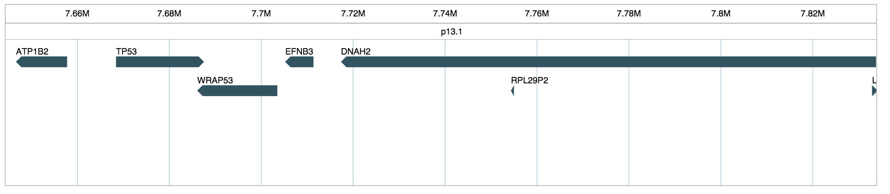

# genecluster-vis

This is a d3.js based web tool for gene cluster visual representation (in the sense of physical genomic locations). Data is loaded from NCBI's gene database and rendered with SVG. 

### Demo
For a live demo visit here:
http://linjoey.github.io/genecluster-vis/

Drag to pan, scroll to zoom. 

### Agenda
- Encode transcripts/exons when zoomed in enough
- Allow fast jumping to any gene or genomic/cytogentic location   
- Add tooltip with extra info/links to NCBI entry
- Add chromosome VR
- Support external file loading, Genbank?
- Bugs:
    - Dont let user scroll past bounds
    - Dynamic Height calculations
    - Hide titles if there's not enough room, or somehow show it 
    - laggy on huge data loads

### API
**under development

### License
MIT
